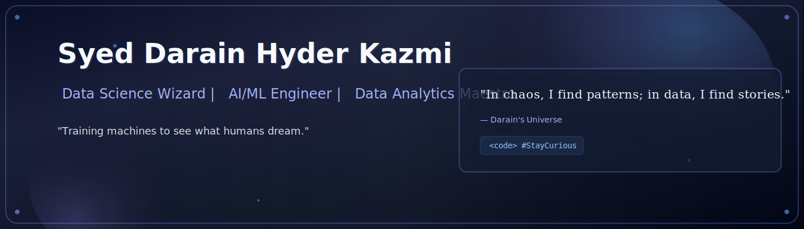

  

---

### 🌌 About Me  

> *"Turning data into meaning, one bug at a time."*  

I find beauty in messy datasets and poetry in perfectly optimized loops.  
When not busy breaking my own code (for science 😎), I'm fine-tuning models, scraping insights, or chasing the next spark of automation magic.  

- 🔭 Currently experimenting with **algorithms that almost think**  
- 🌱 Diving deep into **Data Science**, **NLP**, and **Computer Vision**  
- 👯 Open for **collaborations**, **debugging marathons**, and **caffeine-fueled innovation**  
- ⚡ Fun fact: Sometimes my models perform better than my sleep schedule  
- 📫 Connect: [Portfolio](https://darainhyder.netlify.app) • **darainhyder21@gmail.com** • [LinkedIn](https://www.linkedin.com/in/syed-darain-hyder-kazmi)  

> *"In a world of noise, I train models to listen."*

---

### 🛠️ Skills & Tools  

---

### 📊 GitHub Stats

---

### 🔥 GitHub Streak

  

---

### 🏆 GitHub Trophies

  

---

### 🐍 Contribution Snake

---

### 👀 Profile Views

---

### 💡 Dev Quote

<i>"Code first, regret later."</i>

---

### 🌐 Let's Connect

---

✨ Thanks for scrolling this far (you weirdo). ✨

