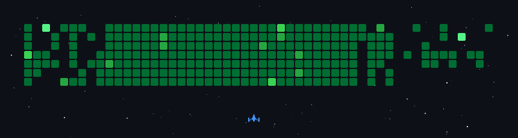

<div align="center">
  

  <br/><br/>

  

  <p>
    <sub><code>ai / ml</code> &nbsp;·&nbsp; <code>data science</code> &nbsp;·&nbsp; <code>llms</code> &nbsp;·&nbsp; <code>mlops</code> &nbsp;·&nbsp; <code>databases</code></sub>
  </p>

  <p>
    <a href="https://darainhyder.netlify.app"></a>
    <a href="https://www.linkedin.com/in/syed-darain-hyder-kazmi"></a>
    <a href="https://www.fiverr.com/darainhyder"></a>
    <a href="https://www.upwork.com/freelancers/~016542608fe0bf33cf"></a>
  </p>
</div>

<br/>

<div align="center">
  
</div>

<br/>

<h3 align="left"><code>darain@nexus:~/system$ ./hire_me.sh --freelance</code></h3>

```bash
$ whoami --role
AI Engineer | I build AI that actually ships, not just demos.

$ ls ./services
AI agents · RAG chatbots · LLM integration · custom ML & computer vision models · full-stack AI web apps

$ ./hire_me.sh --status
[+] STATUS: open for freelance work. Select a channel below.
```

<p align="center">
  <a href="https://www.fiverr.com/s/mmmDB7z"></a>
  <a href="https://www.upwork.com/freelancers/~016542608fe0bf33cf"></a>
  <br/>
  <a href="https://www.fiverr.com/darainhyder"></a>
</p>

<br/>

<div align="center">
  
</div>

<br/>

<h3 align="left"><code>darain@nexus:~/system$ ./init_architect.sh</code></h3>

```bash
[+] Establishing connection to data streams... OK
[+] Philosophy loaded: "Data is chaotic. I bring the structure."
[+] Executing primary loop:
    > Navigating complex datasets to uncover hidden patterns.
    > Training models to perceive the world.
    > Constructing digital infrastructure.
[!] STATUS: Precision is the goal. Logic is the method. Innovation is the result.
```

<br/>

<div align="center">
  
</div>

<br/>

<h3 align="left"><code>darain@nexus:~/system$ ./view_active_processes.sh</code></h3>

<div align="center">
  <p><code>[ THREAD: 0x01 ]</code> <strong>LEARNING</strong> ➔ Expanding capabilities in Large Language Models & Vector Databases.</p>
  <p><code>[ THREAD: 0x02 ]</code> <strong>BUILDING</strong> ➔ Architecting scalable MLOps pipelines and Full-Stack integrations.</p>
  <p><code>[ THREAD: 0x03 ]</code> <strong>EXPLORING</strong> ➔ The intersection of automated reasoning and deep neural networks.</p>
</div>

<br/>

<div align="center">
  
</div>

<br/>

<h3 align="left"><code>darain@nexus:~/system$ ./view_deployments.sh</code></h3>

<div align="center">
  <table border="1" style="border-collapse: collapse; border-color: #FF2020;">
    <tr>
      <td width="33%" align="center" style="padding: 15px;">
        <h3>[::] Adaptive E-Learning</h3>
        <p>Multi-agent AI system with reinforcement-based feedback loops.</p>
        <p><code>NLP</code> <code>Reinforcement Learning</code></p>
      </td>
      <td width="33%" align="center" style="padding: 15px;">
        <h3>[//] BioMed Research Helper</h3>
        <p>AI assistant utilizing PubMed API mining & vector semantic search.</p>
        <p><code>Streamlit</code> <code>FastAPI</code> <code>LLMs</code></p>
      </td>
      <td width="33%" align="center" style="padding: 15px;">
        <h3>[##] Image Quality Scoring</h3>
        <p>Deep learning pipeline for blind CNN image quality assessment.</p>
        <p><code>PyTorch</code> <code>Docker</code> <code>CNN</code></p>
      </td>
    </tr>
  </table>
</div>

<br/>

<div align="center">
  
</div>

<br/>

<h3 align="left"><code>darain@nexus:~/system$ cat /etc/arsenal.conf</code></h3>

<p align="center">
  
  
  
  
  
  
  
  
  
  
  
  
  
  
  
  
  
  
  
  
  
  
  
  
</p>

<br/>

<div align="center">
  
</div>

<br/>

<h3 align="left"><code>darain@nexus:~/system$ htop --telemetry</code></h3>

<div align="center">
  
  
</div>

<br/>

<h3 align="left"><code>darain@nexus:~/system$ tail -f /var/log/activity.log</code></h3>

<div align="center">
  
</div>

<br/>

<div align="center">
  
</div>

<br/>

<div align="center">
  
</div>

<br/>

<h3 align="left"><code>darain@nexus:~/system$ ./execute_arena_simulation.sh</code></h3>

<p align="center">
  <i>Control the ship. Dodge the incoming objects. Survive the run.</i>
</p>

<div align="center">
  <a href="https://github.com/DarainHyder">
    
  </a>
</div>

<br/>

<div align="center">
  
</div>

<br/>

<h3 align="left"><code>darain@nexus:~/system$ ssh connect@darain-hyder</code></h3>

<p align="center">
  Initiate contact for collaborations, technical discussions, or visionary projects.
</p>

<p align="center">
  <a href="https://www.linkedin.com/in/syed-darain-hyder-kazmi"></a>
  <a href="mailto:darainhyder21@gmail.com"></a>
  <a href="https://darainhyder.netlify.app"></a>
</p>

<br/>

<div align="center">
  <i>"We do not just write code. We whisper to the silicon. We teach the sand to think. We command the data to dream."</i>
</div>

<p align="center">
  
</p>

<div align="center">
  
</div>
